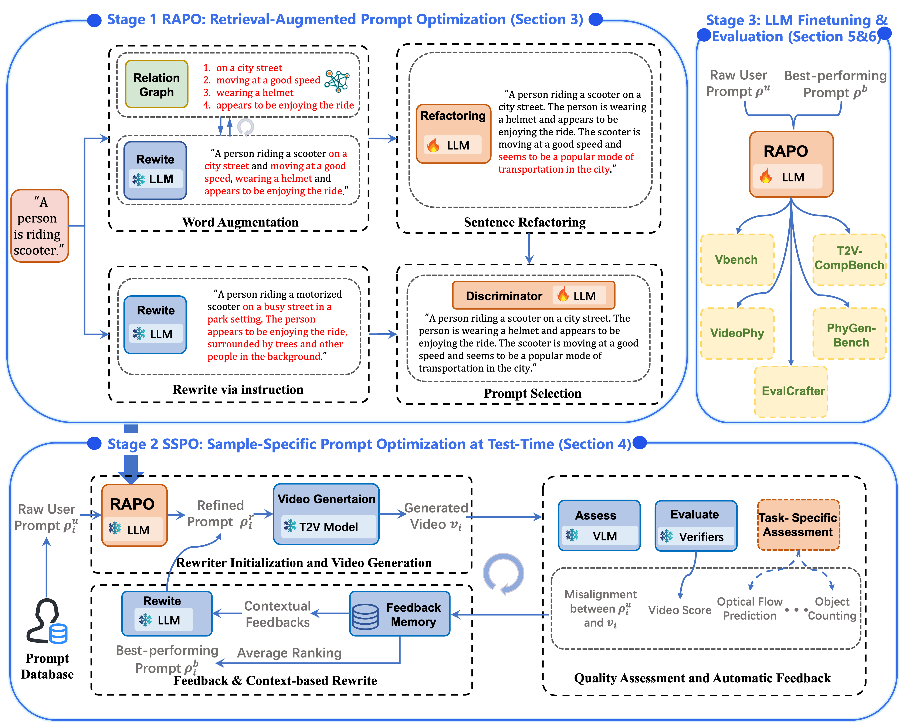

# RAPO++: Prompting Test-Time Scaling for Text-to-Video Generation
<p align="center">
  <a href="https://arxiv.org/pdf/2504.11739" target="_blank"></a>
  <a href='https://whynothaha.github.io/Prompt_optimizer/RAPO.html' target="_blank"></a>
  <a href="https://arxiv.org/abs/2510.20206" target="_blank"></a>
  <a href='https://whynothaha.github.io/RAPO_plus_github/' target="_blank"></a>
  <a href="https://huggingface.co/papers/2510.20206" target="_blank"></a>
</p >

<p align="center">
<strong><big>
If you find our work useful, please consider giving us a star🌟</big></strong>
</p>


## 📚 AutoPage
Our website is automatically generated using our [**AutoPage**](https://mqleet.github.io/AutoPage_ProjectPage/), a multi-agent system we highly recommend for effortless academic page creation.

## 📋 Table of Contents

This is the official implementation for
- [RAPO] [The Devil is in the Prompts: Retrieval-Augmented Prompt Optimization for Text-to-Video Generation, **CVPR 2025**](https://arxiv.org/abs/2502.07516)
- [RAPO++: Cross-Stage Prompt Optimization for Text-to-Video Generation via Data Alignment and Test-Time Scaling, arXiv:2510.20206](https://arxiv.org/abs/2510.20206)
  - [🔎 Overview](#-overview)
  - [🤗 Checkpoint](#-checkpoint) 
  - [🛠️ Installation](#-installation)
  - [🚀 Quick Start](#-quick-start)
  - [📐 Evaluation](#-evaluation)


## 🔎 Overview
RAPO++ is a three-stage framework that enhances text-to-video generation without modifying model architectures. It unifies data-aligned prompt refinement (RAPO), test-time iterative optimization (SSPO), and LLM fine-tuning**, enabling more coherent, compositional, and physically realistic video synthesis. Tested on five state-of-the-art models and benchmarks, RAPO++ consistently improves semantic alignment, temporal stability, and visual fidelity, setting a new standard for prompt optimization in T2V generation. 

The core contribution of RAPO++ lies in SSPO, a model-agnostic, closed-loop mechanism that iteratively refines prompts through feedback from generated videos. When using RAPO++, users can replace RAPO with their model’s built-in prompt refiner as initialization. The feedback data collected during SSPO can then be used to fine-tune the refiner itself, further enhancing model-specific prompt optimization.



## 🛠️ Installation
1. Clone the Repository
```
git clone https://github.com/Vchitect/RAPO.git
cd RAPO
```
2. Set up Environment
```
conda create -n rapo_plus python=3.10
conda activate RAPO
pip install torch==2.5.1 torchvision==0.20.1 torchaudio==2.5.1 --index-url https://download.pytorch.org/whl/cu118 
pip install -r requirements.txt
```

## 🤗 Checkpoint  
### Stage 1 RAPO
Download the required model weights [RAPO](https://huggingface.co/bingjie/RAPO/tree/main), relation graph and pretrained LLM (e.g. , [
Mistral-7B-Instruct-v0.3](https://huggingface.co/mistralai/Mistral-7B-Instruct-v0.3/tree/main) )and place them in the `ckpt/` and `relation_graph/` directory.
```
ckpt/
│── all-MiniLM-L6-v2/
│── llama3_1_instruct_lora_rewrite/
│── Mistral-7B-Instruct-v0.3/
relation_graph/
│── graph_data/
```
### Stage 2 SSPO
We take Wan2.1-T2V as the base model to illustrate the process of SSPO. Download the required model weights [Wan2.1-T2V](https://huggingface.co/Wan-AI/Wan2.1-T2V-1.3B/tree/main), [Qwen2.5-7B-Instruct](https://huggingface.co/Qwen/Qwen2.5-7B-Instruct/tree/main), [Qwen2.5-VL-7B-Instruct](https://huggingface.co/Qwen/Qwen2.5-VL-7B-Instruct/tree/main]), and place them in the `ckpt/` directory.

```
ckpt/
│── Wan2.1-T2V-1.3B-Diffusers/
│── Qwen2.5-7B-Instruct/
│── Qwen2.5-vl-7B-instruct/
```


## 🚀 Quick Start
### Stage 1 RAPO
```
cd ./examples/Stage1_RAPO/
```
0. We provide the codes to compose the graph data. We provide two examples of inputs to compose the graph data (`./dataset/graph_test1.csv` and `./dataset/graph_test2.csv`). You can build a relation graph from scratch based on the constructed data:
```
python construct_graph.py
```
or you can add data based on the already constructed relation graph:
```
python add_to_graph.py
```
1. Retrieve related modifiers from relation graph. You can adjust the hyperparameters in `retrieve_modifiers.py` to modify the number of retrieval modifiers.
```
sh retrieve_modifiers.sh
```
2. Word augmentation and sentence refactoring.
```
sh word_augment.sh
sh refactoring.sh
```
3. Rewrite via instruction.
```
sh rewrite_via_instruction.sh
```
### Stage 2 SSPO
```
cd ./examples/Stage2_SSPO/
```
We take **physical-aware video generation** based on Wan2.1 as an example. We provide an examples.csv file in this directory, which contains some test prompts and the physical rules that T2V generation needs to comply with.
For quickly start, the script generates and refines videos iteratively by combining Wan 2.1 T2V generation, Qwen2.5-VL alignment scoring, and physics-based prompt rewriting to enhance realism and consistency. You can modify the script to change the base model, include custom reward functions and historical-prompt backtracking for task-specific adaptation.
```
python phyaware_wan2.1.py
```

### Stage 3 LLM finetuning
For LLM fine-tuning, the process depends on the selected T2V base models and further refines the Stage 2 naive-optimized prompts.  
Examples include [Open-Sora-Plan](https://huggingface.co/LanguageBind/Open-Sora-Plan-v1.3.0), [Wan2.1](https://huggingface.co/Wan-AI/Wan2.1-T2V-1.3B), [HunyuanVideo](https://huggingface.co/tencent/HunyuanVideo-PromptRewrite), and et.al.


## ✒️ Citation
If you find our work helpful for your research, please consider giving a citation 📝

```
@article{gao2025rapopp,
  title   = {RAPO++: Cross-Stage Prompt Optimization for Text-to-Video Generation via Data Alignment and Test-Time Scaling},
  author  = {Gao, Bingjie and Ma, Qianli and Wu, Xiaoxue and Yang, Shuai and Lan, Guanzhou and Zhao, Haonan and Chen, Jiaxuan and Liu, Qingyang and Qiao, Yu and Chen, Xinyuan and Wang, Yaohui and Niu, Li},
  journal = {arXiv preprint arXiv:2510.20206},
  year    = {2025}
}
```
```
@InProceedings{Gao_2025_CVPR,
    author    = {Gao, Bingjie and Gao, Xinyu and Wu, Xiaoxue and Zhou, Yujie and Qiao, Yu and Niu, Li and Chen, Xinyuan and Wang, Yaohui},
    title     = {The Devil is in the Prompts: Retrieval-Augmented Prompt Optimization for Text-to-Video Generation},
    booktitle = {Proceedings of the IEEE/CVF Conference on Computer Vision and Pattern Recognition (CVPR)},
    month     = {June},
    year      = {2025},
    pages     = {3173-3183}
}
```
